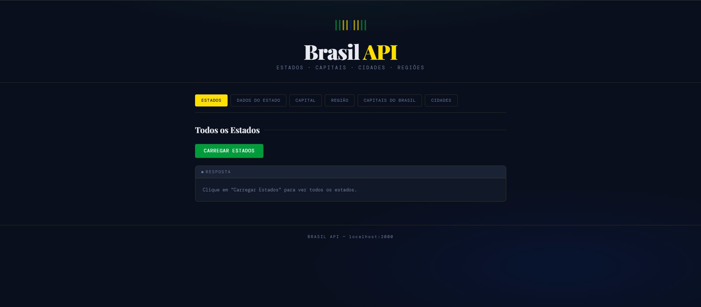
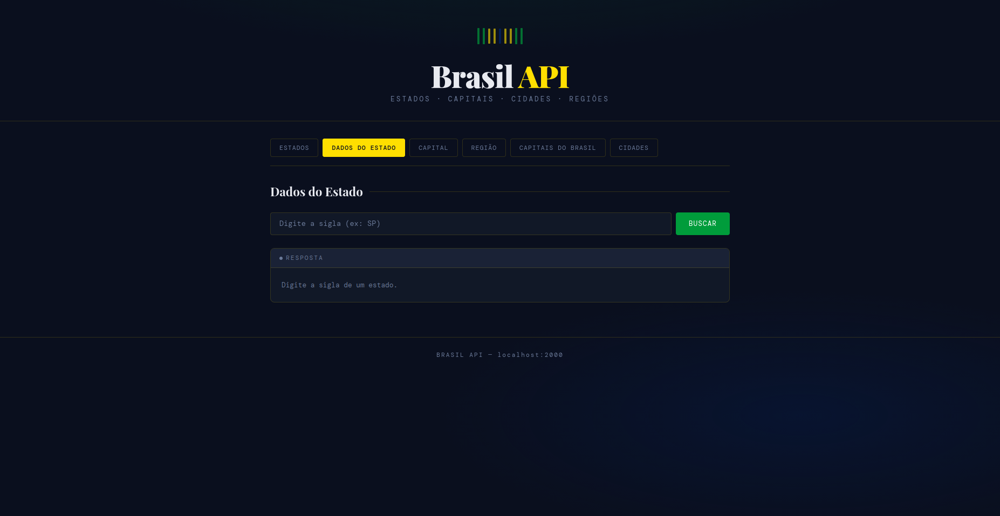
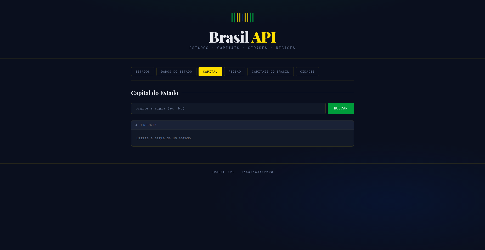
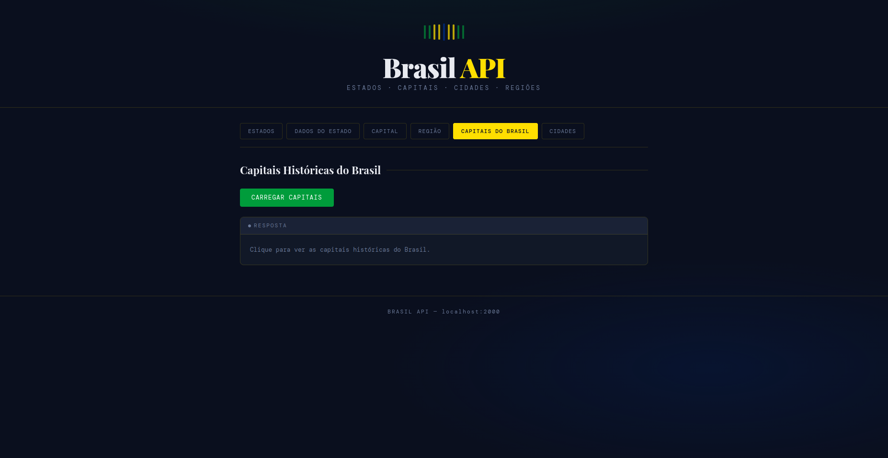
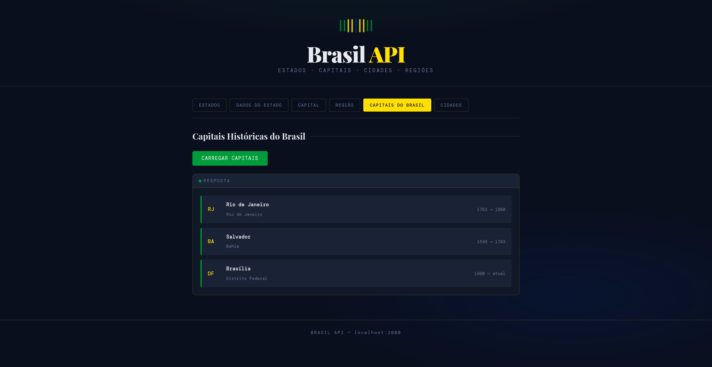

# 🇧🇷 Brasil API

API REST desenvolvida em Node.js com Express que fornece dados sobre os estados, capitais, cidades e regiões do Brasil, com um front-end integrado para consumo visual dos dados.

---

## 🖥️ Prévia do Projeto

**Tela inicial — Lista de Estados**


**Busca por dados do estado**


**Busca da capital por sigla**


**Capitais históricas — antes de carregar**


~~**Capitais históricas — resultado**~~
~~
---

## 📁 Estrutura do Projeto

```
Missão 04/
│
├── Server/
│   ├── app.js                  # Servidor Express e rotas da API
│   ├── package.json
│   ├── package-lock.json
│   └── modulo/
│       ├── fuction.js          # Funções de consulta aos dados
│       └── estados_cidades.js  # Base de dados dos estados e cidades
│
├── public/
│   ├── index.html              # Interface do front-end
│   ├── favicon.svg             # Ícone do site
│   ├── css/
│   │   └── style.css           # Estilos da interface
│   └── js/
│       └── script.js           # Lógica de consumo da API
│
├── docs/
│   └── screenshots/            # Imagens do projeto
│
└── .gitignore
```

---

## 🚀 Como rodar o projeto

### Pré-requisitos

- [Node.js](https://nodejs.org/) v18 ou superior
- [npm](https://www.npmjs.com/)
- Extensão [Live Server](https://marketplace.visualstudio.com/items?itemName=ritwickdey.LiveServer) no VS Code

### Instalação

```bash
# Entre na pasta do servidor
cd Server

# Instale as dependências
npm install
```

### Iniciando o servidor

```bash
# Dentro da pasta Server
node app.js
```

O servidor estará rodando em `http://localhost:2000`.

### Abrindo o front-end

Com o Live Server instalado no VS Code, clique com o botão direito no arquivo `public/index.html` e selecione **Open with Live Server**.

O front-end abrirá em `http://127.0.0.1:5500`.

---

## 📡 Rotas da API

Base URL: `http://localhost:2000`

| Método | Rota | Descrição |
|--------|------|-----------|
| GET | `/estados` | Retorna a lista com todas as siglas dos estados e a quantidade total |
| GET | `/estado/:uf` | Retorna os dados completos de um estado pela sigla |
| GET | `/capital/:uf` | Retorna a capital de um estado pela sigla |
| GET | `/regiao/:regiao` | Retorna todos os estados de uma região |
| GET | `/capitais` | Retorna as capitais históricas do Brasil |
| GET | `/cidades/:uf` | Retorna todas as cidades de um estado pela sigla |

### Exemplos de uso

```bash
GET /estados
GET /estado/SP
GET /capital/RJ
GET /regiao/Sul
GET /capitais
GET /cidades/MG
```

### Exemplo de resposta — `/estado/SP`

```json
{
  "uf": "SP",
  "descricao": "São Paulo",
  "capital": "São Paulo",
  "regiao": "Sudeste"
}
```

### Exemplo de resposta — `/cidades/AC`

```json
{
  "uf": "AC",
  "descricao": "Acre",
  "quantidade_cidades": 22,
  "cidades": ["Acrelândia", "Assis Brasil", "Brasiléia", "..."]
}
```

---

## 🛠️ Tecnologias utilizadas

**Back-end**
- [Node.js](https://nodejs.org/)
- [Express](https://expressjs.com/)
- [CORS](https://www.npmjs.com/package/cors)

**Front-end**
- HTML5
- CSS3
- JavaScript (Fetch API)
- Google Fonts — Playfair Display + DM Mono

---

## 📦 Dependências

```json
{
  "express": "^5.2.1",
  "cors": "^2.8.5"
}
```

---

## 👤 Autor

Desenvolvido por **Pedro** como parte das atividades do curso Back-End — SENAI.

---

## 📄 Licença

Este projeto está sob a licença MIT.
