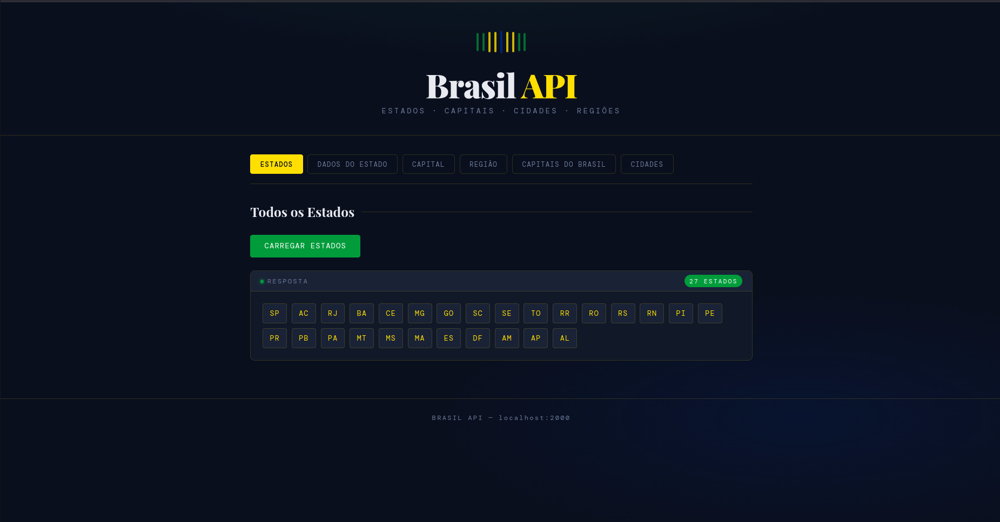
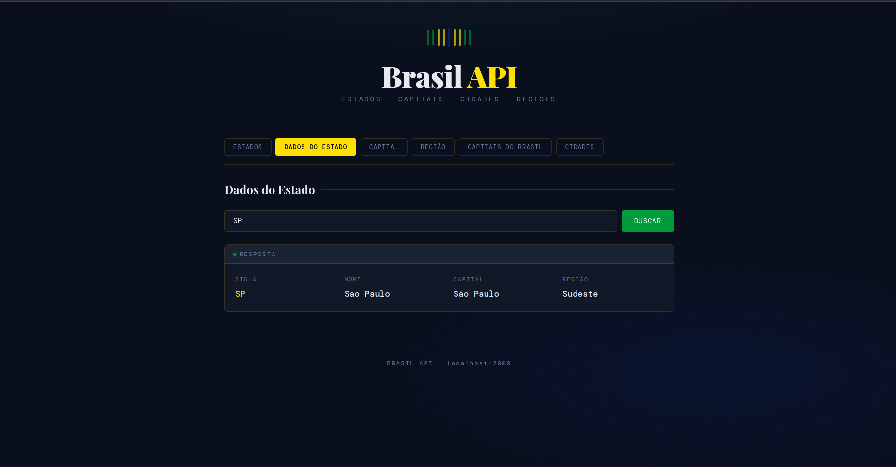
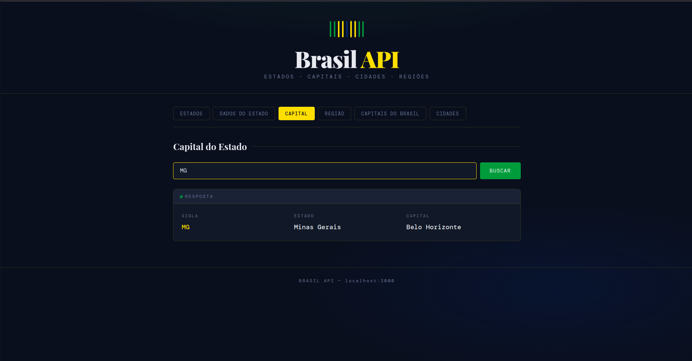
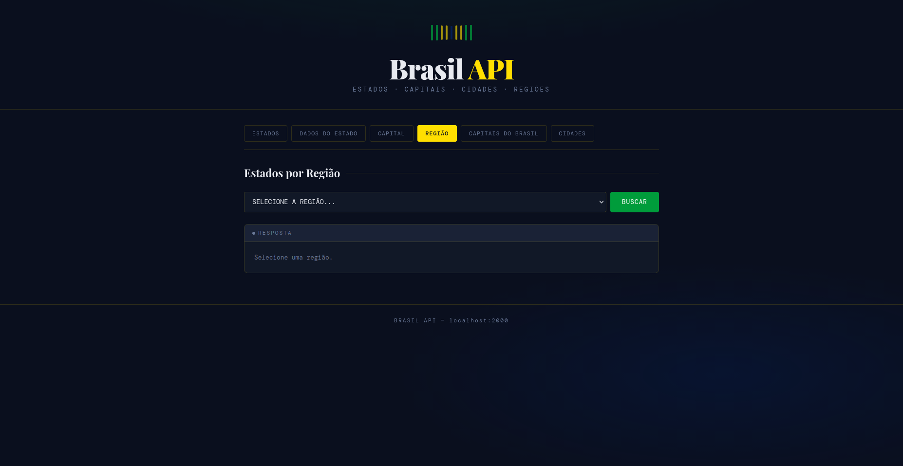
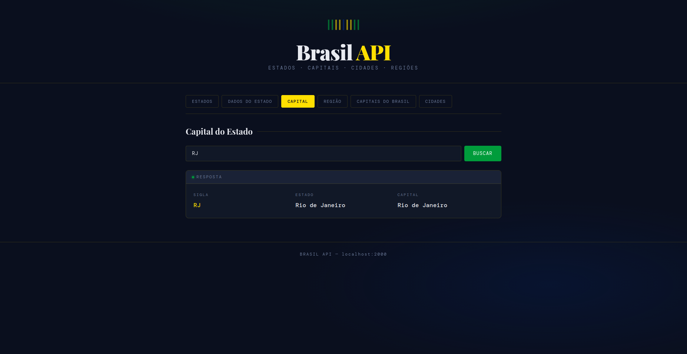
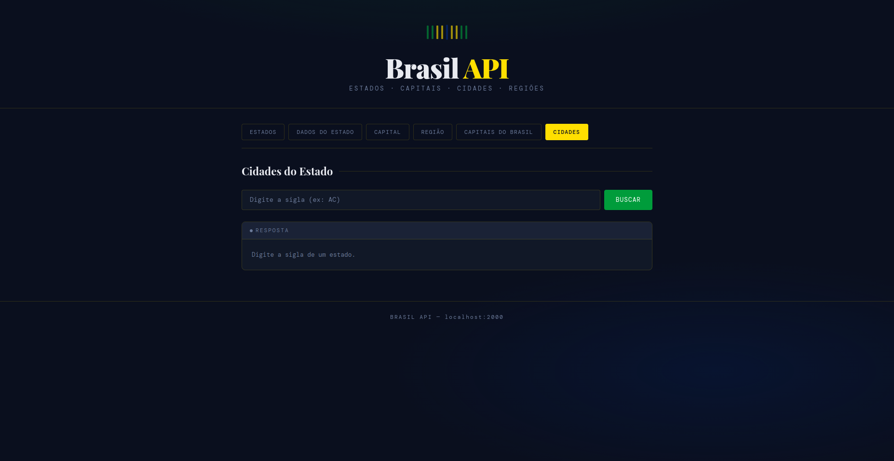
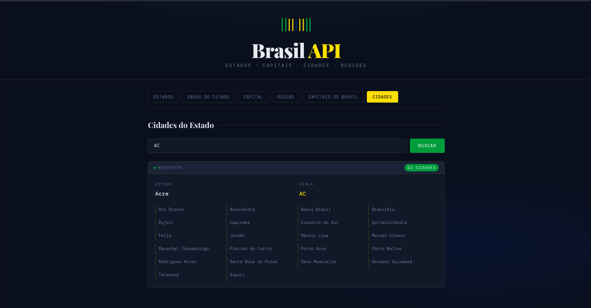

<div align="center">

# 🇧🇷 Brasil API

**API REST desenvolvida em Node.js com Express para fornecer dados sobre estados, capitais, cidades e regiões do Brasil**


<br/>

🌐 **[Acesse a API online](https://sua-api-brasil.onrender.com)**  
📡 **Base URL:** `https://sua-api-brasil.onrender.com`

</div>

---

## 📖 Sobre o Projeto

API REST desenvolvida com foco em organização e boas práticas para fornecer dados completos sobre o Brasil, incluindo estados, capitais, cidades e regiões.  

O projeto também conta com um front-end integrado para visualização dos dados de forma simples e intuitiva.

---

## 🖥️ Prévia do Projeto

**Tela inicial — Lista de Estados**  
  
*Página inicial da aplicação com o botão para carregar todos os estados brasileiros.*

  
*Após clicar em "Carregar Estados", são exibidas as siglas dos 27 estados em formato de cards.*

---

**Dados do Estado**  
  
*Campo de busca para consultar informações completas de um estado pela sigla.*

  
*Resultado da busca exibindo sigla, nome completo, capital e região do estado.*

---

**Capital do Estado**  
  
*Campo de busca para consultar a capital de um estado pela sigla*

  
*Resultado exibindo a sigla, o nome do estado e sua respectiva capital.*

---

**Estados por Região**  
  
*Menu dropdown para selecionar uma das cinco regiões do Brasil.*

  
*Resultado listando todos os estados pertencentes à região selecionada em cards.*

---

**Capitais Históricas do Brasil**  
  
*Tela de capitais históricas antes do carregamento dos dados.*

  
*Lista das capitais históricas do Brasil com sigla, cidade, estado e período em que foi capital.*

---

**Cidades do Estado**  
  
*Campo de busca para listar todas as cidades de um estado pela sigla.*

  
*Resultado exibindo todas as cidades do estado buscado, com nome, sigla e quantidade total.*

---

## ✨ Funcionalidades

- ✅ Listagem de todos os estados brasileiros
- ✅ Consulta de dados completos de um estado
- ✅ Busca da capital por sigla
- ✅ Filtro de estados por região
- ✅ Listagem de capitais históricas do Brasil
- ✅ Consulta de todas as cidades de um estado
- ✅ Interface visual integrada com consumo da API

---

## 📁 Estrutura do Projeto

```
API-Brazil/
│
├── Server/
│   ├── app.js                  # Servidor Express e rotas da API
│   ├── package.json
│   ├── package-lock.json
│   └── modulo/
│       ├── fuction.js          # Funções de consulta aos dados
│       └── estados_cidades.js  # Base de dados dos estados e cidades
│
├── public/
│   ├── index.html              # Interface do front-end
│   ├── favicon.svg             # Ícone do site
│   ├── css/
│   │   └── style.css           # Estilos da interface
│   └── js/
│       └── script.js           # Lógica de consumo da API
│
├── docs/
│   └── screenshots/            # Imagens do projeto
│
└── .gitignore
```

---

## 🛠️ Tecnologias utilizadas

**Back-end**
- Node.js
- Express
- CORS

**Front-end**
- HTML5
- CSS3
- JavaScript (Fetch API)
- Google Fonts — Playfair Display + DM Mono

---

## 🚀 Como rodar o projeto

### Pré-requisitos

- Node.js v18 ou superior  
- npm  
- Extensão Live Server (VS Code)

### Instalação

```bash
cd Server
npm install
```

### Iniciando o servidor

```bash
node app.js
```

O servidor estará rodando em:

```
http://localhost:2000
```

### Abrindo o front-end

Abra o arquivo `public/index.html` com o Live Server.

---

## 🚀 Deploy da API (Render)

### 1. Suba o projeto no GitHub

```bash
git init
git add .
git commit -m "deploy api"
git branch -M main
git remote add origin https://github.com/seu-usuario/sua-api.git
git push -u origin main
```

### 2. Configure no Render

- Acesse: https://render.com  
- Clique em **New Web Service**
- Conecte o repositório

**Configurações:**

- Build Command: `npm install`
- Start Command: `node app.js`

### 3. Configure a porta no app.js

```js
const PORT = process.env.PORT || 2000;
app.listen(PORT, () => console.log(`Servidor rodando na porta ${PORT}`));
```

### 4. Atualize o link no README

Substitua:

```
https://sua-api-brasil.onrender.com
```

pelo seu link real.

---

## 📡 Rotas da API

Base URL: `https://sua-api-brasil.onrender.com`

| Método | Rota | Descrição |
|--------|------|-----------|
| GET | `/estados` | Retorna todos os estados |
| GET | `/estado/:uf` | Dados completos de um estado |
| GET | `/capital/:uf` | Capital do estado |
| GET | `/regiao/:regiao` | Estados por região |
| GET | `/capitais` | Capitais históricas |
| GET | `/cidades/:uf` | Cidades do estado |

### Exemplos de uso

```bash
GET /estados
GET /estado/SP
GET /capital/RJ
GET /regiao/Sul
GET /capitais
GET /cidades/MG
```

---

## 📦 Dependências

```json
{
  "express": "^5.2.1",
  "cors": "^2.8.5"
}
```

---

## 👤 Autor

Desenvolvido por **Pedro** — SENAI

---

## 📄 Licença

Este projeto está sob a licença MIT.
